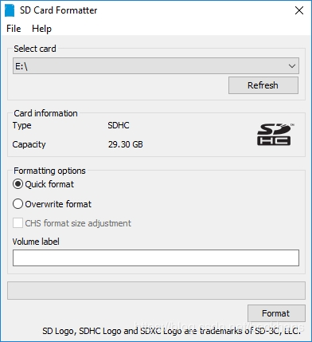
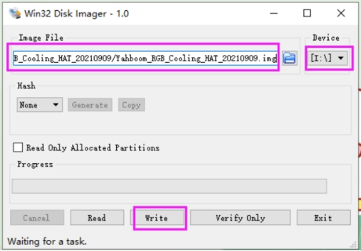
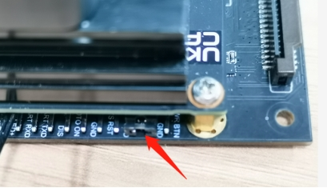
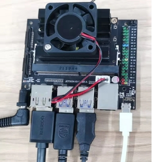
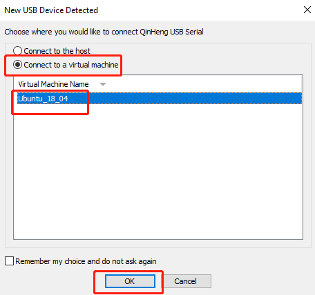
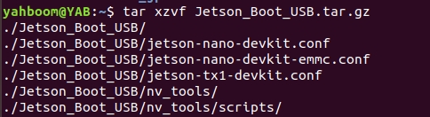
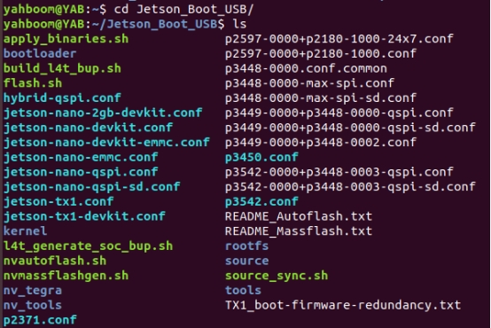
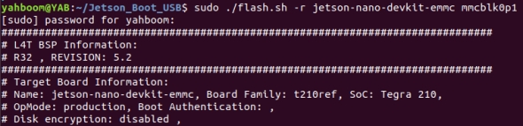
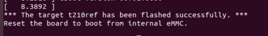

## 9.1 Jetson Nano write sytem

[toc]

Note: 1. Jetson Nano has multiple versions, JETSON NANO B01 official version and JETSON NANO B01 SUB version, both versions can be used with the robot, this product is factory standard as JETSON NANO B01 SUB version, before leaving the factory The robot image system has been configured. Generally, users do not need to follow this tutorial to flash the image system. 

2.Different versions have different flashing methods. Among them, the JETSON NANO B01 official version uses the TF card to flash the image method, and the JETSON NANO B01 SUB version needs to burn the U disk image + flash the EMMC boot method. 

3.The method of burning the U disk system is the same as the process of burning the TF card system. The following content takes burning the U disk image as an example.

### 1. Prepare to install 

1.Prepare a win10 computer and a USB flash drive (32G or larger is recommended). This step of burning the USB flash drive does not require the participation of Jetson Nano. 

2.Download the mirror 

Find the factory image in the data, and download the corresponding image compressed package file according to different motherboards. 

System default username: jetson, password: yahboom 

3.Format SD card 

Use SDFormatter to format the U disk, and be careful not to select the wrong Drive here, otherwise it will cause unnecessary trouble. If the U disk has already programmed the system, there may be an error in the first format, just execute it again. 



### 2. Burn the U disk system 

1.Unzip the downloaded system compressed file to get the img image file 

2.Insert the U disk into the computer USB port 

3.Unzip and run the Win32DiskImager tool 

4.Select the img (image) file in the software, select the drive letter of the U disk under "Device", then select "Write"  and then start burning the system. According to the speed of your U disk, the burning process is fast or slow. . 



5.A completion dialog box will pop up after the burning is completed, indicating that the installation is complete. If it is unsuccessful, please close the software such as the firewall, and reinsert the U disk for burning. Please note that after the installation, the U disk is divided into multiple partitions under the Windows system and cannot be clicked to enter. This is a normal phenomenon, because the disk partition under Linux cannot be seen under win! 

So far, the Jetson Nano has been programmed successfully. After the burning is successful, the system may prompt to format the partition because the partition cannot be recognized. Do not format at this time! Do not format! Do not format! Click Cancel, then eject the USB drive. 

### 3. Burn EMMC boot 

This step is not required for the JETSON NANO B01 official version, this step is dedicated to the JETSON NANO B01 SUB version. Under normal circumstances, the JETSON NANO B01 SUB motherboard of the trolley has already burned the EMMC boot file. Unless the EMMC boot is cleared by the burning operation, there is no need to re-burn the EMMC boot. 

1. Prepare Jetson nano motherboard, jumper caps, display screen, mouse and keyboard, etc. 

2. Let the jetson Nano enter the system REC flashing mode. 

Connect the jumper caps to the FC REC and GND pins, that is, to the second and third pins of the carrier board below the core board, as shown in the image below: 

 

3. Connect the line, connect the HDMI display, mouse and keyboard to the Jetson Nano, then plug in the power supply, and finally insert the microUSB data cable. Since the jumper cap has been connected to the FC REC and GND pins in the previous step, it will automatically enter the REC flashing mode after power on. 

 

Under normal circumstances, the following window will pop up after inserting the microUSB data cable. Note here that you need to set the device to connect to the virtual machine to use the virtual machine. 

 

4. Please transfer the Jetson_Boot_USB.tar.gz file in the data to the Ubuntu 18.04 system, and open the terminal to run the decompression command. 

```shell
tar xzvf Jetson_Boot_USB.tar.gz 
```



5. After unzipping, go to the Jetson_Boot_USB folder, then 

```shell
cd Jetson_Boot_USB/ 
ls 
```

 

6. Run the command to burn the EMMC boot file. 

```shell
sudo ./flash.sh -r jetson-nano-devkit-emmc mmcblk0p1 
```

 

7. Finally, wait for the file to be burned into the EMMC, and it will prompt "The target t210ref has been flashed successfully. 

Reset the board to boot from internal eMMC.” 

 

If an error message appears, please confirm whether the Jetson Nano is connected normally, enter the flashing mode, and reconnect to burn. 

After the burning is completed, please unplug the jumper cap of the Jetson Nnao, then insert the U disk, and power on again. 

Note: If you are using the virtual machine provided in the Jetson data, and the Jetson_Boot_USB file is already included, you do not need to transfer it to the system again. 

Virtual machine username: yahboom 

Password: yahboom 
